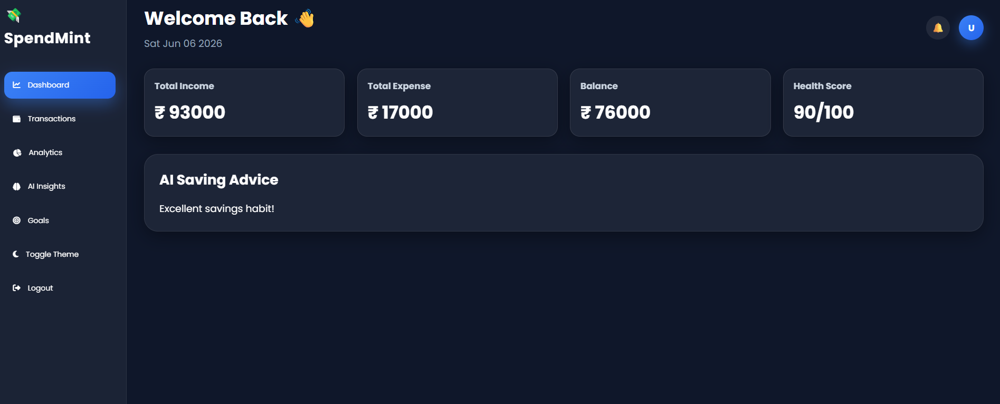
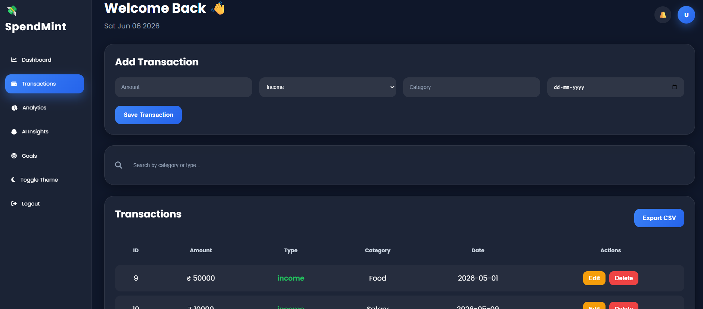
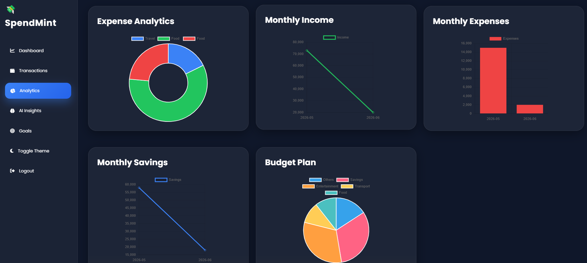
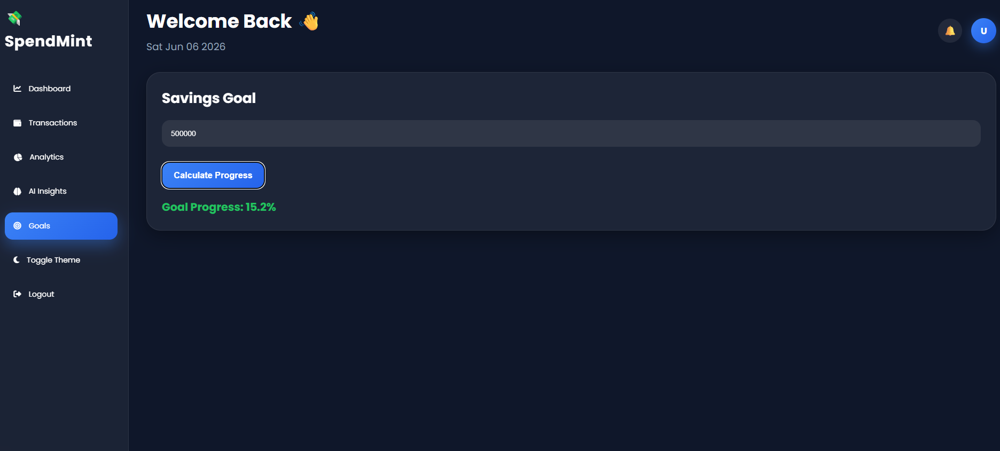
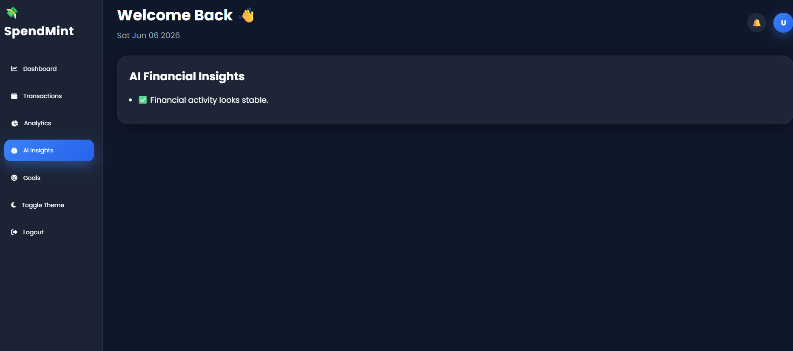

# SpendMint

AI-Powered Personal Finance & Expense Tracking Application

## Features

- User Authentication
- Add/Edit/Delete Transactions
- Financial Health Score
- AI Saving Advice
- Monthly Income Analytics
- Monthly Expense Analytics
- Monthly Savings Tracking
- Budget Planning
- Spending Insights
- Category Analysis
- Export CSV
- Dark/Light Theme

## Tech Stack

Frontend:
- HTML
- CSS
- JavaScript
- Chart.js

Backend:
- Spring Boot
- Spring Data JPA
- Hibernate

Database:
- MySQL

## Run Project

1. Configure application.properties
2. Create MySQL Database
3. Run Spring Boot Application
4. Open Frontend Pages

## Screenshots

### Login

### Dashboard

### Transactions

### Analytics

### Goals

### Insights

